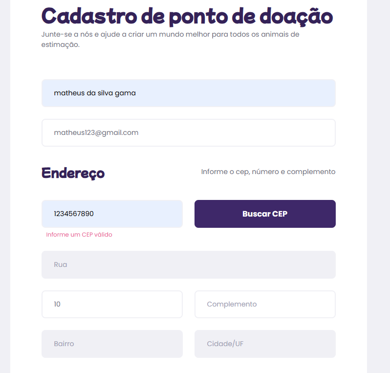

# O cadastro permite finalizar com o CEP inválido

- **ID do Bug:** BUG-001  
- **ID do caso de teste:** 07  

## Descrição

Ao preencher todos os campos do formulário e inserir um CEP inválido no campo "CEP", ao clicar no botão "Cadastrar", o formulário permite que o cadastro seja finalizado corretamente, mesmo com o CEP inválido.

## Passos para Reproduzir

1. Acesse a página do formulário.
2. Preencha todos os campos obrigatórios corretamente, exceto o campo "CEP", que deve ser preenchido com um CEP inválido (exemplo: "1234567890").
3. Clique no botão "Buscar CEP".
4. Em seguida, clique no botão "Cadastrar".

## Resultado Esperado

- Com um CEP inválido, o formulário não deveria permitir a finalização do cadastro.

## Resultado Atual

- O sistema exibe a mensagem "Informe um CEP válido", mas permite a finalização do cadastro com o CEP inválido.

## Impacto

A utilização de um CEP inválido pode resultar em falhas no preenchimento automático do endereço, erros no envio de correspondências ou produtos, inconsistências nos cadastros e dificuldades de integração com APIs externas. Além disso, compromete a experiência do usuário e gera retrabalho para correção manual. Recomenda-se a implementação de uma validação adequada para evitar o problema.

## Ambiente de Teste

- **Dispositivo:** Navegador Google Chrome - Versão 133.0.6943.127 (64 bits)  
- **Sistema Operacional:** Windows 11  

## Severidade

- **Média**

## Prioridade

- **Média**

## Evidência

